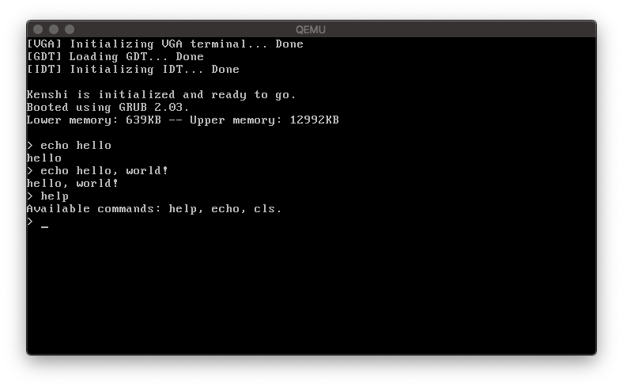

# kenshi

A 32-bit toy operating system for self-education.
Written in C (and some x86 assembly) for the x86 architecture.
Uses the GRUB bootloader, but theoretically works with any bootloader that supports the multiboot standard.



## Features

### Finished

- VGA text output (support for strings and numbers, including printf)
- Serial port input and output
- Interrupt/exception handling
- Support for basic input via keyboard
- Very basic shell

### Planned
- Mouse support
- Advanced shell
- File system

...and many more!

## Usage

**Note:** The following steps have only been tested on MacOS Mojave.

**Requirements:** A version of GCC setup to generate i686-elf code, grub utils (namely grub-mkrescue & grub-file).

Using the following command you can generate an `.iso` file containing this very kernel:
```
$ make all
```
The newly generated file will be called `kenshi.iso`.

This iso can now be used as a CDROM to boot the kernal.
Using qemu it would look like this:
```
$ qemu-system-i386 -cdrom kenshi.iso
```
You can also use `make run` to do above two steps automatically.

Burning the `.iso` to a CD and using it on a physical computer might also work, but it has not been tested.

## License

Licensed under the [MIT License](LICENSE.md).
